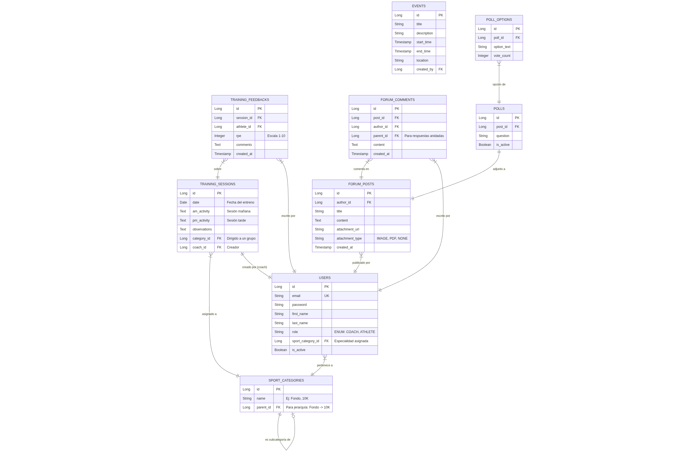

# Modelo de Base de Datos - UN-SportHub

Este documento describe la estructura de tablas y relaciones para la base de datos PostgreSQL.

## Diagrama Entidad-Relación (ERD)

## Diccionario de Datos y Justificación

### 1. Tabla `USERS` y `SPORT_CATEGORIES`

Esta es la parte clave para tu requerimiento de "Agrupar y Subvariantes".

* **USERS:** Tabla central. El campo `role` distingue entre Entrenador y Deportista.
* **SPORT_CATEGORIES:** Usamos una relación reflexiva (`parent_id`).
* *Ejemplo:*
* Registro 1: ID=1, Nombre="Fondo", Parent=NULL
* Registro 2: ID=2, Nombre="10K", Parent=1

* El usuario se asigna al ID 2 (10K). Gracias a la relación, sabemos que también es de "Fondo".

### 2. Tabla `TRAINING_SESSIONS` (El "Excel")

Para lograr la vista tipo Excel sin crear una tabla gigante, normalizamos por día.

* En lugar de guardar "Mes de Marzo", guardamos registros individuales por día (`date`).
* **Logica del Frontend:** Cuando el entrenador pida "Marzo", el Backend hará un `SELECT * FROM sessions WHERE date BETWEEN '2023-03-01' AND '2023-03-31' AND category_id = X`.
* Esto permite editar celdas individuales fácilmente.

### 3. Tabla `TRAINING_FEEDBACKS`

* Separa la planificación (lo que dice el entrenador) de la ejecución (lo que sintió el atleta).
* Se vincula a la sesión específica y al atleta específico.

### 4. Módulo de Foro (`FORUM_POSTS`, `COMMENTS`)

* Soporta hilos anidados gracias al `parent_id` en la tabla de comentarios (similar a Reddit).
* `attachment_url` está preparado para guardar la ruta del archivo (que guardaremos localmente en una carpeta al principio).

---

### Análisis de la Arquitectura de Datos

Diseño enfocado en Java Spring Boot con JPA (Hibernate):

1.  **Herencia vs Composición:** Para las categorías, se utiliza una tabla separada (`SPORT_CATEGORIES`) en lugar de herencia de clases Java. Esto proporciona mayor flexibilidad; si se requiere agregar nuevas categorías, solo se inserta un registro en la base de datos, evitando modificaciones en el código fuente.
2.  **Escalabilidad del Foro:** Se implementa una estructura de comentarios anidados estándar.
3.  **Fechas:** Se utiliza `LocalDate` de Java para las fechas de entrenamiento (sin hora) y `LocalDateTime` para eventos y publicaciones (con hora).
